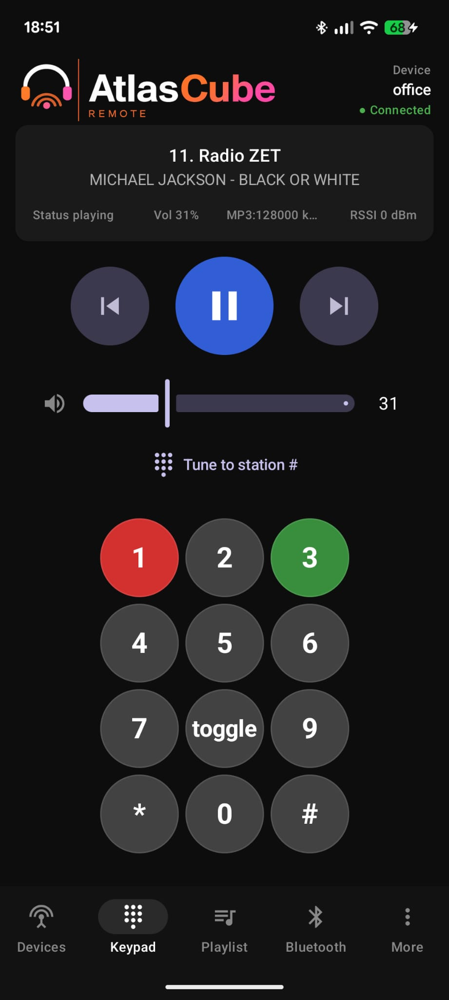
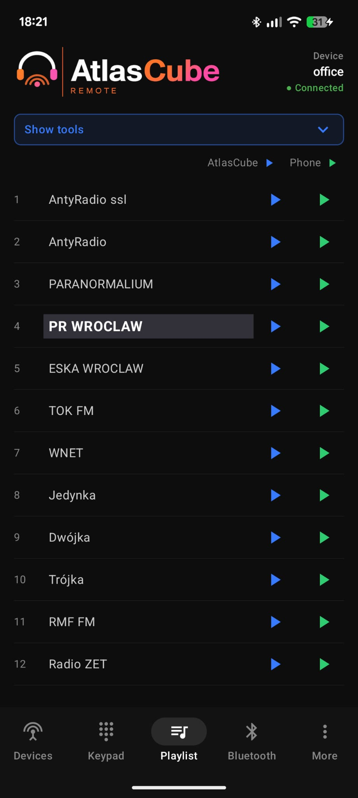
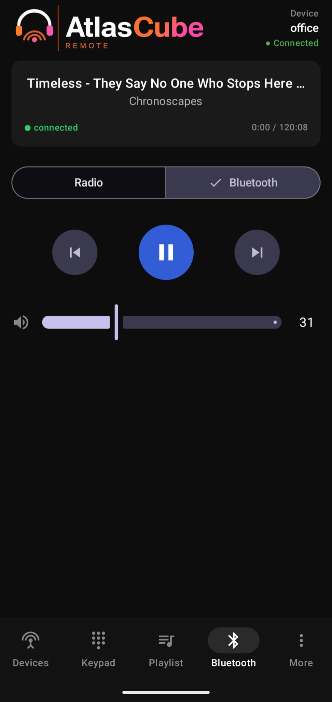
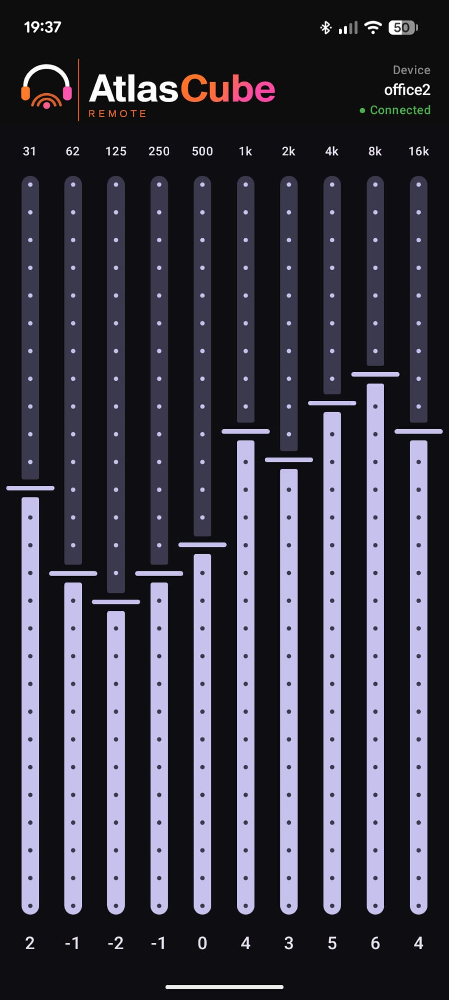
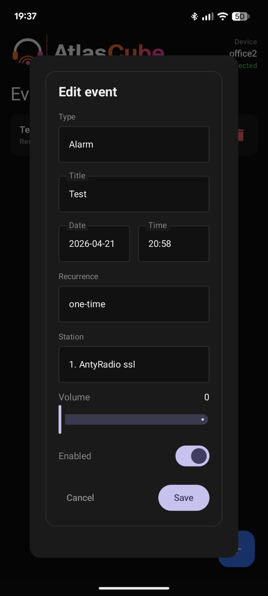
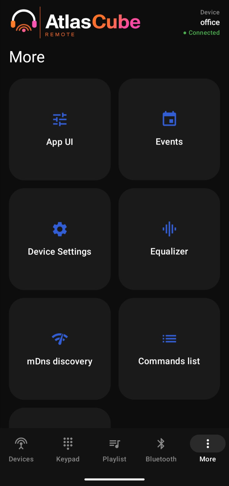
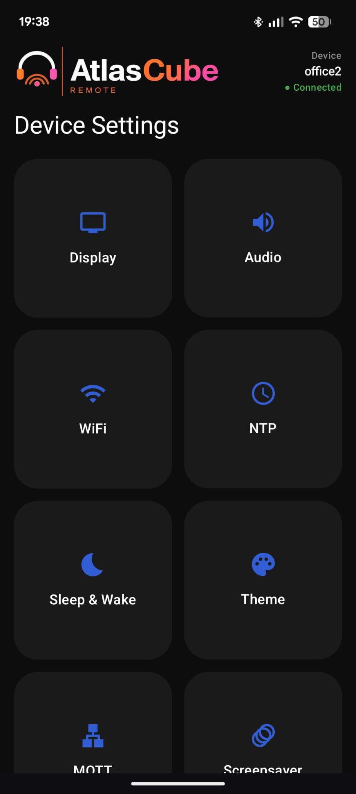
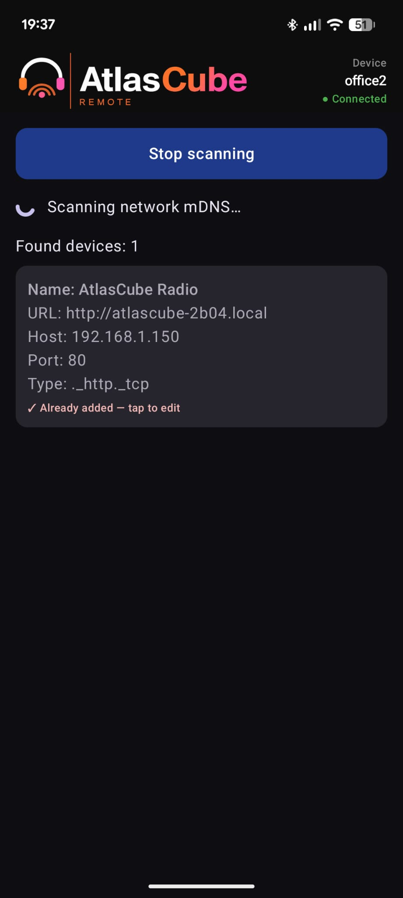
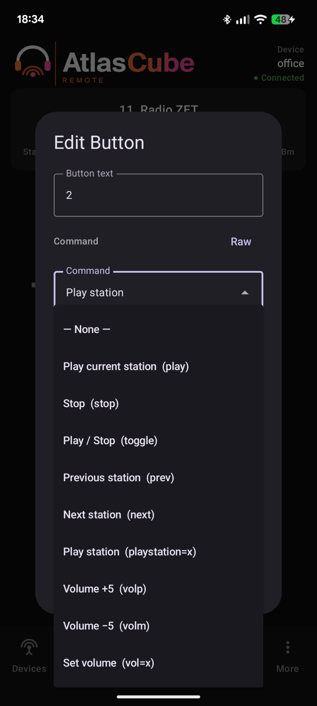

# AtlasCube Remote

An Android app to control an **AtlasCube** internet‑radio device over your local
network. It gives you full remote control of playback, playlists, sound,
Bluetooth, scheduled events, photo-frame slides and the device's settings — all
from your phone.

📲 **[Get it on Google Play](https://play.google.com/store/apps/details?id=net.atlascube.remote)** — currently available for testers only.

## What it does

- **Radio control** — play/stop, next/previous, volume, and a programmable
  keypad, with live "now playing" info (station, title, codec, bitrate). Keypad
  buttons are configured with a command picker plus a "raw" mode for advanced
  combinations.
- **Playlist** — browse the device playlist, mark **favorites** (pinned to the
  top), reorder, edit and save back to the device.
- **Equalizer** — 10‑band EQ that mirrors the device sound.
- **Bluetooth** — switch the device audio source between Radio and Bluetooth,
  see track metadata and drive transport (prev/play/pause/next) and volume.
- **Events** — create and manage the device's scheduled events (reminders,
  birthdays, name days, anniversaries, radio alarms and **voice notifications**).
  For a voice notification the phone synthesizes the spoken message on-device
  (TTS) and uploads it to the device's SD card; you can preview the clip and see
  the spoken text right in the editor. Events run on the device itself, so they
  fire even when your phone is off.
- **Photo frame & SD files** — browse the device's microSD card (upload, rename,
  delete files). Turn phone photos into photo-frame slides in one step: pick an
  image and the app converts it to the device's panel-sized format and uploads
  it. The screensaver's source folder, order, reveal effect and timing are set
  from Device Settings → Screensaver.
- **Discovery (mDNS)** — find AtlasCube devices on your network automatically,
  no IP typing needed. Using mDNS (the same "Bonjour"/zero‑configuration tech
  AirPlay and printers use), each device announces itself by its friendly
  `<name>.local` address. Tap a result to add it, pre‑filled with its name and
  address; devices you've already saved are flagged and tap through to edit.
- **Device Settings** — a hub mirroring the device's settings page: Display,
  Audio, WiFi, NTP, Sleep & Wake, Theme (with a colour‑palette editor), MQTT,
  Screensaver, and Tools/OTA (firmware update).

## Screenshots

<!-- Replace the placeholders below with real screenshots once captured. -->

| Keypad | Playlist | Bluetooth |
| :----: | :------: | :-------: |
|  |  |  |

| Equalizer | Events | Settings |
| :-------: | :----: | :------: |
|  |  |  |

| Device settings | MDNS | Edit buttons |
| :-------: | :----: | :------: |
|  |  |  |

## Navigation

The bottom bar has five tabs — **Devices, Keypad, Playlist, Bluetooth, More** —
which can be switched by tapping or by **swiping left/right**. Detail screens
(device settings, events, equalizer, MQTT widgets, etc.) open full‑screen from
the **More** tab; system back returns to the tabs.

## Works offline

Settings and events screens stay usable when the device is offline: they show
the last values fetched while online with an "Offline" banner, in read‑only
mode. Saving re‑enables once the device is reachable again.

## Getting started

1. Make sure your phone and the AtlasCube device are on the same Wi‑Fi network.
2. On the **Devices** screen, add the device by its IP address or hostname
   (e.g. `192.168.1.150`) — or let the automatic network scan find it and tap to
   add.
3. Open it and you're in control.
